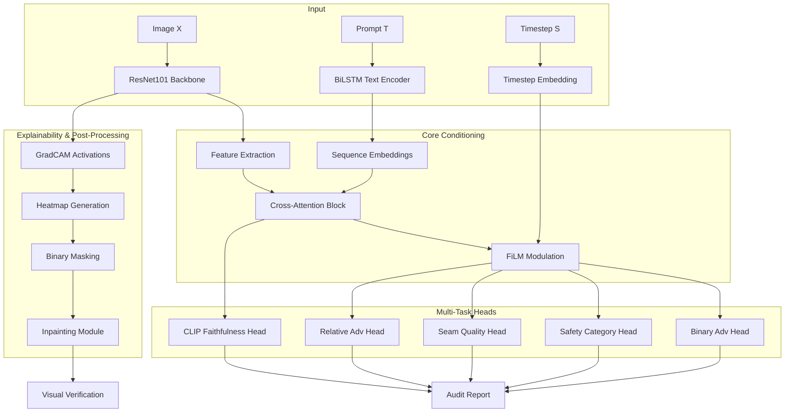

# Adversarial Image Auditor: Architecture & Evolution Documentation

## Overview
The `train_new_final_this.py` script is the finalized version of the Adversarial Image Auditor, a multi-modal safety evaluation system designed for Text-to-Image (T2I) generation. It uses a combination of vision-language alignment, diffusion-aware feature modulation, and multi-task learning to detect hidden safety violations and adversarial artifacts.

---

## 1. Core Architecture: How It Works

### High-Level Design
The system operates as a **Multi-Task Neural Network** built on a vision backbone, conditioned by a text encoder and diffusion metadata.

1.  **Vision Backbone (ResNet101):** Extracts deep spatial features. While larger models were tested, ResNet101 was selected for its balance of high-level feature representation and inference speed.
2.  **Prompt-Image Alignment:**
    -   **Text Encoder:** A BiLSTM-based encoder processes the generation prompt into sequence embeddings.
    -   **Cross-Attention:** A multi-head attention mechanism allows the network to focus on specific image regions mentioned in the prompt (e.g., "violence" or "nudity").
    -   **InfoNCE Contrastive Loss:** Inspired by CLIP, this loss ensures the model understands *what* it is seeing in the context of the prompt, independent of its safety classification.
3.  **Diffusion Timestep Awareness (FiLM):**
    -   Adversarial artifacts in AI-generated images look different at various stages of the diffusion process (e.g., initial noise vs. final refinement).
    -   The model encodes the `timestep` and uses **Feature-wise Linear Modulation (FiLM)** to adjust the network's filters dynamically.

### Specialized Audit Heads
-   **Safety Categories:** Predicts Safe, Nudity, or Violence with high sensitivity.
-   **Object Detection Heatmaps:** Generates visual "proof" of why an image was flagged.
-   **Seam Quality:** Detects inpainting boundaries and "unnatural" compositions common in adversarial attacks.
-   **Relative Adversary Score:** A continuous metric quantifying how "aggressive" an adversarial manipulation is.

---

## 2. The Evolutionary Journey: What We Tried

The architecture evolved through three distinct research phases:

### Phase 1: Prototype (Early `train.py`)
-   **Backbone:** ResNet101.
-   **Taxonomy:** 4-class (Safe, NSFW, Gore, Weapon).
-   **Architecture:** Simple feature concatenation of image and text.
-   **Lessons:** Concatenation was too "loose" and didn't provide strong enough grounding for complex prompts. The 4-class taxonomy was too broad.

### Phase 2: Experimental Heavyweight (`train_v3.py` / `train_v4.py`)
-   **Backbone:** **ConvNeXt-Base** (timm).
-   **Taxonomy:** 5-class (Safe, Violence, Sexual, Illegal Activity, Disturbing).
-   **Text Encoder:** **Frozen CLIP-ViT-Large**.
-   **Enhancements:** Focal Loss to handle heavy class imbalance.
-   **Results:** High accuracy (~80-87%), but the model was computationally heavy and the frozen CLIP encoder was sometimes too "generic" for specific audit tasks.

### Phase 3: Optimized Final (`train_new_final_this.py`)
-   **Backbone:** Returned to **ResNet101** for deployment efficiency and stable gradients.
-   **Taxonomy:** Refined to 3-class (Safe, Nudity, Violence) based on the `internvl-auditor-v2` dataset.
-   **Innovation:** Replaced frozen CLIP with a **custom BiLSTM Aligner** trained with InfoNCE. This allowed the alignment signal to be specifically tuned for "safety violations" rather than general aesthetic description.
-   **Final Polish:** Integrated the FiLM-based timestep conditioning to solve the "denoising artifact" problem.

---

## 3. Why the Shifts? (Design Rationale)

The project underwent several "pivots" to find the optimal balance between accuracy, interpretability, and performance.

### From Prototype (Phase 1) to Experimental (Phase 2)
*   **The Problem:** Initial concatenation of text and image was too "weak." The model often ignored the prompt and relied solely on visual cues, leading to poor performance on prompt-conditioned violations.
*   **The Shift:** We introduced **Cross-Attention** and **Frozen CLIP**. By letting image patches "query" text tokens, we forced the model to check if the visual content actually matched the prompt. We also adopted **Focal Loss** to counteract the heavy class imbalance (mostly safe images).

### From Experimental (Phase 2) to Final (Phase 3)
This was the most significant shift, moving from a "brute force" heavyweight model to a highly specialized and efficient auditor.

1.  **Computational Efficiency (ResNet over ConvNeXt):**
    *   ConvNeXt-Base was high-performing but slow. In a production audit pipeline, latency is critical. 
    *   **Decision:** Reverted to **ResNet101**. It provided a cleaner gradient flow for the multi-task heads and was much faster for inference.

2.  **Specialization over Generality (BiLSTM Aligner over CLIP):**
    *   Frozen CLIP is great for general captioning, but safety auditing requires high sensitivity to subtle *vulnerabilities*. 
    *   **Decision:** We replaced the frozen CLIP with a **custom BiLSTM Aligner** trained with **InfoNCE**. This allowed the "faithfulness" signal to be explicitly tuned for detecting where prompts intentionally lead to safety violations.

3.  **Refined Focus (3-Class over 5-Class):**
    *   The 5-category taxonomy (disturbing, illegal, etc.) had significant overlap, which confused the model.
    *   **Decision:** We simplified to **Safe, Nudity, and Violence**. These are the "Big Two" critical violations. Focusing on these allowed for better precision and 5x loss-weighting on critical failures.

4.  **Handling Diffusion Dynamics (The FiLM Innovation):**
    *   **The Discovery:** Adversarial noise looks different at Step 50 than at Step 900. A "one-size-fits-all" model was missing these subtle temporal patterns.
    *   **Decision:** Added **FiLM conditioning**. By telling the model the `timestep`, we enabled it to "re-calibrate" its sensitivity to noise patterns at different stages of the diffusion process.

---

## 4. Full Architecture Flowchart

